# Code Agent

A lightweight, LLM-driven code assistant built on **LangChain** + **DeepAgents** with a **local Ollama** or
OpenAI-compatible backend. The agent has full filesystem access through its tools and can read, create, edit, and append
files directly.

## Features

- **Agentic coding**: DeepAgents-powered agent with tools for read, write, edit, search, and more
- **Filesystem access**: Full read/write/edit/create access through dedicated tools
- **MCP integration**: Load tools from external MCP servers (stdio or HTTP)
- **Human-in-the-loop**: Pause for approval on sensitive operations
- **Web UI**: FastAPI + React interface for browser-based interaction
- **Persistent sessions**: Conversation history saved via LangGraph checkpointing
- **Provider-agnostic**: OpenAI-compatible pattern; supports Ollama, OpenAI, Anthropic, and more
- **Typed configuration**: Pydantic Settings with `.env` support, all keys prefixed `CODE_AGENT_`

## Quick Start

```bash
# Clone and install in editable mode
git clone https://github.com/your-username/code_agent.git
cd code_agent
uv venv
source .venv/bin/activate
uv pip install -e .
```

See [docs/QUICKSTART.qmd](docs/QUICKSTART.qmd) for detailed setup, configuration, and first-run steps.

## Usage

```bash
# Interactive chat
code-agent chat

# Start web UI
code-agent serve --web

# List available tools
code-agent tools list
```

See [docs/USAGE.qmd](docs/USAGE.qmd) for CLI and Python API examples.

## Configuration

The agent uses a three-layer configuration system:

1. **Config file**: `config/codeagent.jsonc` or `config/codeagent.yaml`
2. **`.env` file**: Values referenced from the config file with `${env:VAR_NAME}`
3. **Environment variables**: `CODE_AGENT_*` variables override config and `.env`

See [docs/CONFIGURATION.qmd](docs/CONFIGURATION.qmd) for the full reference.

## Documentation

- [Quick Start](docs/QUICKSTART.qmd) - Installation and first run
- [Usage](docs/USAGE.qmd) - CLI and Python API examples
- [Tools](docs/TOOLS.qmd) - Built-in filesystem and MCP tools
- [Configuration](docs/CONFIGURATION.qmd) - Config file, `.env`, and env vars
- [Contributing](docs/CONTRIBUTING.qmd) - Guidelines for contributing
- [Changelog](CHANGELOG.qmd) - Release notes and version history

## Class & Package Diagrams




