# API Reference

CodeAgent API is documented with pydoctor. The full API reference is available
at [apidocs](../apidocs/apidocs-help.html).

## Tools API

The `berg_agents.tools` module provides a set of tools for interacting with the filesystem and performing code-related
tasks. These tools are designed to be used by the DeepAgents harness and can be extended with custom tools. To read more
about berg_agents.tools, see [Tools API](../apidocs/berg_agents.tools.html).

## CLI API

The `berg_agents.cli` module provides a command-line interface for interacting with the BergAgent. The CLI allows users
to run the agent in various modes, including chat mode, serve mode, and more. To read more about berg_agents.cli,
see [CLI API](../apidocs/berg_agents.cli.html).

## Core API

There `berg_agents.core`module contains the core functionality of the BergAgent, including the orchestrator and
bookkeeper. To read more about berg_agents.core, see [Core API](../apidocs/berg_agents.core.html).

## Agent API

The `berg_agents.agents` module provides the core functionality of the BergAgent, including the agent's decision-making
logic, tool management, and interaction with the LLM. To read more about berg_agents.agent,
see [Agent API](../apidocs/berg_agents.agents.html).

## Providers API

The `berg_agents.providers` module provides support for different LLM providers, including OpenAI, Anthropic, and
Ollama.
This module allows users to configure and use different LLMs with the BergAgent. To read more about
berg_agents.providers, see [Providers API](../apidocs/berg_agents.providers.html).

## Capabilities API

The `berg_agents.capabilities` module provides a set of capabilities that can be used by the BergAgent to perform
various tasks. These capabilities include code generation, code editing, code analysis, and more. To read more about
berg_agents.capabilities, see [Capabilities API](../apidocs/berg_agents.capabilities.html).

## Configuration API

The `berg_agents.config` module provides functionality for managing the configuration of the BergAgent. This includes
loading configuration files, managing profiles, and handling environment variables. To read more about
berg_agents.config, see [Configuration API](../apidocs/berg_agents.config.html).

## Profiles API

The `berg_agents.profiles` module provides functionality for managing user profiles, which can be used to customize the
behavior of the BergAgent based on different user preferences. To read more about berg_agents.profiles,
see [Profiles API](../apidocs/berg_agents.profiles.html).

## UI API

The `berg_agents.ui` module provides functionality for the web-based user interface of the BergAgent. This includes
serving the UI, handling user interactions, and integrating with the backend agent. To read more about berg_agents.ui,
see [UI API](../apidocs/berg_agents.ui.html).

## UI Web Frontend API

The `berg_agents.ui.web` module provides functionality for the web frontend of the BergAgent, including serving static
files, handling API requests, and managing WebSocket connections. To read more about berg_agents.ui.web,
see [UI Web Frontend API](../apidocs/berg_agents.ui.web.html).

## CI API

The `berg_agents.ci` module provides functionality for continuous integration and testing of the BergAgent. This
includes running tests, managing test environments, and integrating with CI/CD pipelines. To read more about
berg_agents.ci, see [CI API](../apidocs/berg_agents.ci.html).

## Utils API

The `berg_agents.utils` module provides utility functions and classes that are used throughout the BergAgent. These
utilities include logging, file handling, and other helper functions. To read more about berg_agents.utils,
see [Utils API](../apidocs/berg_agents.utils.html).

