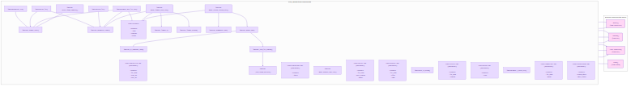
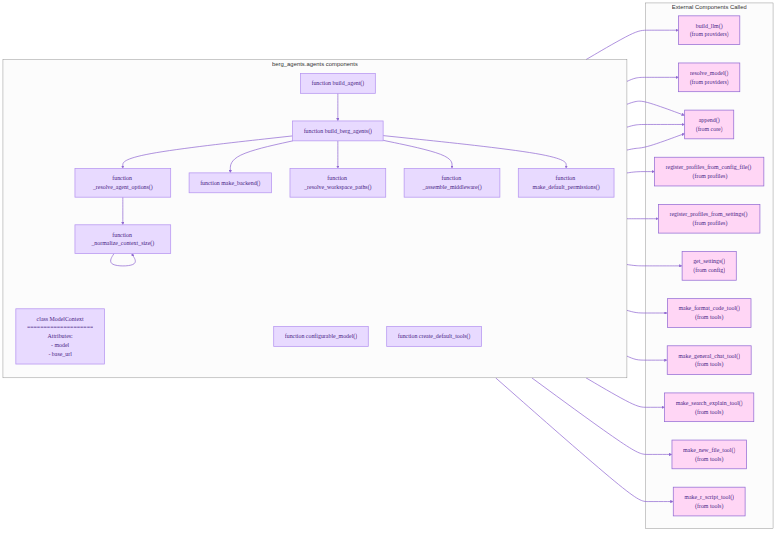
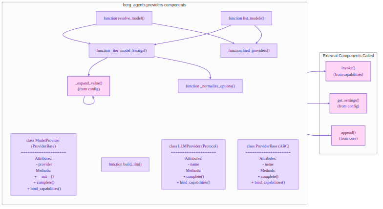
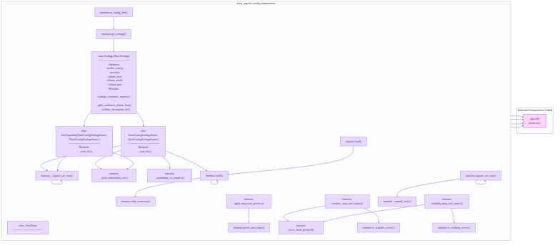
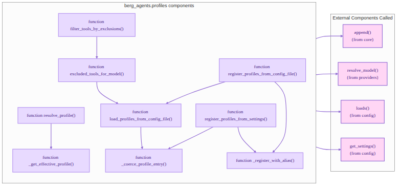
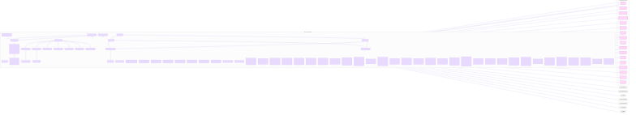
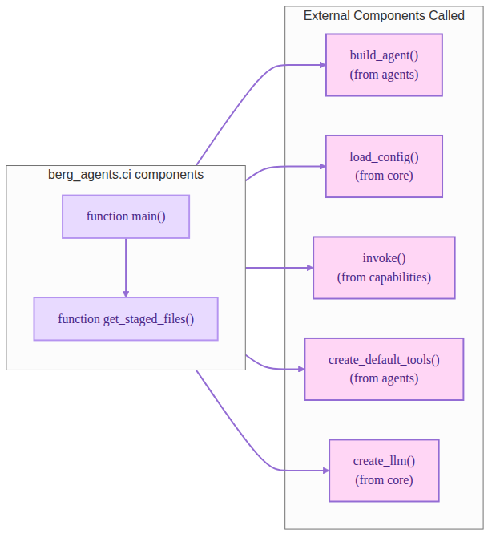
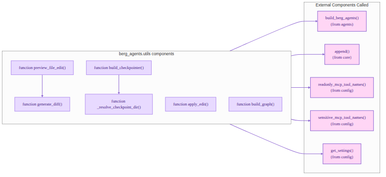

# API Reference

BergAgents API is documented with pydoctor. The full API reference is available
at [apidocs](../apidocs/apidocs-help.html).


## Tools API

The `berg_agents.tools` module provides a set of tools for interacting with the filesystem and performing code-related
tasks. These tools are designed to be used by the DeepAgents harness and can be extended with custom tools. To read more
about berg_agents.tools, see [Tools API](../apidocs/berg_agents.tools.html).



## CLI API

The `berg_agents.cli` module provides a command-line interface for interacting with the BergAgent. The CLI allows users
to run the agent in various modes, including chat mode, serve mode, and more. To read more about berg_agents.cli,
see [CLI API](../apidocs/berg_agents.cli.html).

## Core API

The `berg_agents.core` module is the **framework-agnostic spine** — `Orchestrator` (central coordinator), `ModelRouter`
(complexity → tier), `LearningGate` (adaptive routing), `AbstractAgent` (subagent contract), and `Bookkeeper`.
No LangChain imports in `core/`. To read more, see [Core API](../apidocs/berg_agents.core.html).


## App API (BergAgentsApp — Main Entry Point)

The `berg_agents` package exposes `BergAgentsApp` — the framework-agnostic host that wires the Orchestrator, ModelRouter,
LearningGate, and optional backends. Prefer this over low-level `build_agent`.

```python
from berg_agents import BergAgentsApp
app = BergAgentsApp.create()          # reads config/bergagents.jsonc
app.execute("refactor auth module")   # routes through Guardian → Planner → Implementation
app.list_agents()
app.get_learning_stats()
```

See [App API](../apidocs/berg_agents.app.html).

## Agent API (Subagents)

The `berg_agents.agents` module provides specialized subagents — `Guardian` (HITL), `Planner` (task breakdown),
`Implementation` (code execution), `Curator` (docs/memory), `Learning` (outcome tracking). Each implements `AbstractAgent`.
To read more about subagents, see [Agent API](../apidocs/berg_agents.agents.html).



## Backend API (Framework Adapters)

The `berg_agents.backends` module provides optional framework adapters. `LangChainAdapter` wraps LangGraph/DeepAgents,
`NativeAdapter` uses raw HTTP (zero LangChain dependency). The orchestrator works without either.
See [Backends API](../apidocs/berg_agents.backends.html).

## Learning Gate API

The `berg_agents.core.learning_gate` module is the adaptive layer — records outcomes, generates insights, and stores
in MemPalace. See [Learning Gate API](../apidocs/berg_agents.core.learning_gate.html).

## Providers API

The `berg_agents.providers` module provides support for different LLM providers, including OpenAI, Anthropic, and
Ollama.
This module allows users to configure and use different LLMs with the BergAgent. To read more about
berg_agents.providers, see [Providers API](../apidocs/berg_agents.providers.html).

```markdown

```

## Capabilities API

The `berg_agents.capabilities` module provides a set of capabilities that can be used by the BergAgent to perform
various tasks. These capabilities include code generation, code editing, code analysis, and more. To read more about
berg_agents.capabilities, see [Capabilities API](../apidocs/berg_agents.capabilities.html).

```markdown

```

## Configuration API

The `berg_agents.config` module provides functionality for managing the configuration of the BergAgent. This includes
loading configuration files, managing profiles, and handling environment variables. To read more about
berg_agents.config, see [Configuration API](../apidocs/berg_agents.config.html).

```markdown

```

## Profiles API (LangGraph Adapter Only)

The `berg_agents.profiles` module tunes the **optional** LangGraph/DeepAgents harness (system prompts, tool visibility per
model). It does NOT affect the core orchestrator (`model_routing`/`hitl_rules` in `bergagents.jsonc` do). See
[Profiles API](../apidocs/berg_agents.profiles.html).

```markdown

```

## UI API

The `berg_agents.ui` module provides functionality for the web-based user interface of the BergAgent. This includes
serving the UI, handling user interactions, and integrating with the backend agent. To read more about berg_agents.ui,
see [UI API](../apidocs/berg_agents.ui.html).

```markdown

```

## UI Web Frontend API

The `berg_agents.ui.web` module provides functionality for the web frontend of the BergAgent, including serving static
files, handling API requests, and managing WebSocket connections. To read more about berg_agents.ui.web,
see [UI Web Frontend API](../apidocs/berg_agents.ui.web.html).

## CI API

The `berg_agents.ci` module provides functionality for continuous integration and testing of the BergAgent. This
includes running tests, managing test environments, and integrating with CI/CD pipelines. To read more about
berg_agents.ci, see [CI API](../apidocs/berg_agents.ci.html).

```markdown

```

## Utils API

The `berg_agents.utils` module provides utility functions and classes that are used throughout the BergAgent. These
utilities include logging, file handling, and other helper functions. To read more about berg_agents.utils,
see [Utils API](../apidocs/berg_agents.utils.html).

```markdown

```
