# API Reference

CodeAgent API is documented with pydoctor. The full API reference is available
at [apidocs](../apidocs/apidocs-help.html).


## Tools API

The `code_agent.tools` module provides a set of tools for interacting with the filesystem and performing code-related
tasks. These tools are designed to be used by the DeepAgents harness and can be extended with custom tools. To read more
about code_agent.tools, see [Tools API](../apidocs/code_agent.tools.html).


## CLI API

The `code_agent.cli` module provides a command-line interface for interacting with the code agent. The CLI allows users
to run the agent in various modes, including chat mode, serve mode, and more. To read more about code_agent.cli,
see [CLI API](../apidocs/code_agent.cli.html).


## Agent API

The `code_agent.agents` module provides the core functionality of the code agent, including the agent's decision-making
logic, tool management, and interaction with the LLM. To read more about code_agent.agent,
see [Agent API](../apidocs/code_agent.agents.html).


## Providers API

The `code_agent.providers` module provides support for different LLM providers, including OpenAI, Anthropic, and Ollama.
This module allows users to configure and use different LLMs with the code agent. To read more about
code_agent.providers, see [Providers API](../apidocs/code_agent.providers.html).


## Capabilities API

The `code_agent.capabilities` module provides a set of capabilities that can be used by the code agent to perform
various tasks. These capabilities include code generation, code editing, code analysis, and more. To read more about
code_agent.capabilities, see [Capabilities API](../apidocs/code_agent.capabilities.html).


## Configuration API

The `code_agent.config` module provides functionality for managing the configuration of the code agent. This includes
loading configuration files, managing profiles, and handling environment variables. To read more about
code_agent.config, see [Configuration API](../apidocs/code_agent.config.html).


## Profiles API

The `code_agent.profiles` module provides functionality for managing user profiles, which can be used to customize the
behavior of the code agent based on different user preferences. To read more about code_agent.profiles,
see [Profiles API](../apidocs/code_agent.profiles.html).


## UI API

The `code_agent.ui` module provides functionality for the web-based user interface of the code agent. This includes
serving the UI, handling user interactions, and integrating with the backend agent. To read more about code_agent.ui,
see [UI API](../apidocs/code_agent.ui.html).


## UI Web Frontend API

The `code_agent.ui.web` module provides functionality for the web frontend of the code agent, including serving static
files, handling API requests, and managing WebSocket connections. To read more about code_agent.ui.web,
see [UI Web Frontend API](../apidocs/code_agent.ui.web.html).

## CI API

The `code_agent.ci` module provides functionality for continuous integration and testing of the code agent. This
includes running tests, managing test environments, and integrating with CI/CD pipelines. To read more about
code_agent.ci, see [CI API](../apidocs/code_agent.ci.html).


## Utils API

The `code_agent.utils` module provides utility functions and classes that are used throughout the code agent. These
utilities include logging, file handling, and other helper functions. To read more about code_agent.utils,
see [Utils API](../apidocs/code_agent.utils.html).

