# Configuration

CodeAgent uses a three-layer configuration system. Values are resolved in order of increasing precedence:

1. **Config file**: `config/codeagent.jsonc`, `config/codeagent.yaml`, or
   `config/codeagent.yml`.
2. **`.env` file**: A `.env` file at the project root. Values can be referenced from the config file using
   `${env:VAR_NAME}` or `${VAR_NAME}`
   placeholders.
3. **Environment variables**: Any `BERG_AGENT_*` environment variable overrides the config file and `.env` values.

By default, the agent loads **all config files** including `config/profiles.yaml`
for DeepAgents harness profiles.

## Config File

The config file is the primary place to define agent behavior. JSONC files support comments and trailing commas.

Example `config/codeagent.jsonc`:

```jsonc
{
  "BERG_AGENT_PROVIDER": "ollama",
  "BERG_AGENT_OLLAMA_MODEL": "${env:BERG_AGENT_OLLAMA_MODEL}",
  "BERG_AGENT_OLLAMA_BASE_URL": "http://localhost:11434",
  "BERG_AGENT_TEMPERATURE": 0.7,
  "BERG_AGENT_STREAM_ENABLED": true
}
```

Example `config/codeagent.yaml`:

```yaml
BERG_AGENT_PROVIDER: ollama
BERG_AGENT_OLLAMA_MODEL: "${env:BERG_AGENT_OLLAMA_MODEL}"
BERG_AGENT_OLLAMA_BASE_URL: "http://localhost:11434"
BERG_AGENT_TEMPERATURE: 0.7
BERG_AGENT_STREAM_ENABLED: true
```

## `.env` File

Store secrets and defaults in a `.env` file at the project root. Values referenced from the config file with
`${env:VAR_NAME}` are resolved from here.

Example `.env`:

```dotenv
BERG_AGENT_OLLAMA_MODEL=gpt-oss:20b
BERG_AGENT_OLLAMA_BASE_URL=http://localhost:11434
BERG_AGENT_TEMPERATURE=0.7
```

## Environment Variables

Any setting can be overridden with an environment variable. The variable name matches the config key, upper-cased with
the `BERG_AGENT_` prefix.

Common variables:

- `BERG_AGENT_PROVIDER`: LLM provider (`ollama`, `openai`, `anthropic`).
- `BERG_AGENT_OLLAMA_MODEL`: Ollama model name.
- `BERG_AGENT_OLLAMA_BASE_URL`: Ollama server URL.
- `BERG_AGENT_OPENAI_API_KEY`: OpenAI API key.
- `BERG_AGENT_OPENAI_BASE_URL`: OpenAI-compatible API base URL.
- `BERG_AGENT_OPENAI_MODEL`: OpenAI model name.
- `BERG_AGENT_TEMPERATURE`: Sampling temperature (default `0.7`).
- `BERG_AGENT_STREAM_ENABLED`: Enable SSE streaming (`true`/`false`).

## Profiles

DeepAgents harness profiles are loaded automatically from `config/profiles.yaml`
by default. Profiles tune the system prompt, tool visibility, and middleware per model.

Example `config/profiles.yaml`:

```yaml
"ollama":
  system_prompt_suffix: "Be concise and prefer minimal, focused diffs."
  excluded_tools: []
  tool_description_overrides:
    read_file: "Read a file from the workspace (read-only)."
```

Profile keys can be:
- A bare provider name (e.g. `"ollama"`) for provider-wide defaults
- A `provider:model` pair (e.g. `"openai:gpt-4o"`) for per-model overrides

Note: model identifiers containing `:` (e.g. `gpt-oss:20b`) cannot be used as exact `provider:model` keys — register
them under the bare provider key instead.

## CLI Flags

- `--config <path>`: Load a specific config file instead of the default
  `config/codeagent.jsonc` / `config/codeagent.yaml`.

## Precedence Example

Given:

- Config file: `BERG_AGENT_TEMPERATURE = 0.7`
- `.env`: `BERG_AGENT_TEMPERATURE=0.9`
- Environment: `BERG_AGENT_TEMPERATURE=0.5`

The effective value is `0.5` (environment variable wins).


## Configuration classes diagrams









