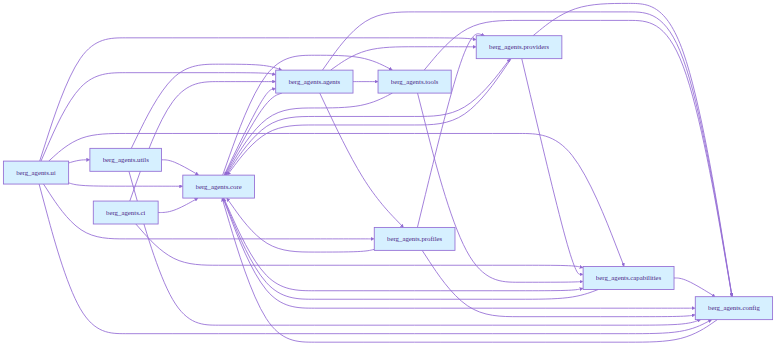
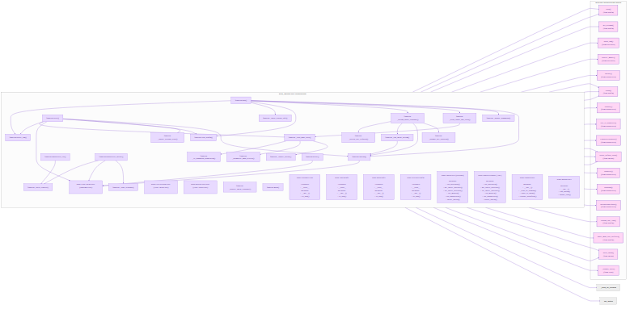

<!-- README.md is generated from README.qmd. Please edit that file -->

```{r, include = FALSE}
knitr::opts_chunk$set(
  collapse = TRUE,
  comment = "#>"
)
```

# berg_agents

<!-- badges: start -->

> CodeAgent A lightweight, LLM-driven assistant built on LangChain + DeepAgents.

<!-- badges: end -->
## Quick Start

```bash
# Install dependencies (uv is recommended)
uv venv .venv
source .venv/bin/activate
uv pip install -e .

# Run the interactive agent
code-agent chat
```

## Features

- **Agentic coding**: DeepAgents-powered agent with tools for read, write, edit, search, and more
- **Filesystem access**: Full read/write/edit/create access through dedicated tools
- **MCP integration**: Load tools from external MCP servers (stdio or HTTP)
- **Human-in-the-loop**: Pause for approval on sensitive operations
- **Web UI**: FastAPI + React interface for browser-based interaction
- **Provider-agnostic**: OpenAI-compatible pattern; supports Ollama, OpenAI, Anthropic, and more


See [docs/USAGE.qmd](../docs/USAGE.qmd) for CLI and Python API examples.

## Configuration

The agent uses a three-layer configuration system:

1. **Config file**: `config/codeagent.jsonc` or `config/codeagent.yaml`
2. **Profile file**: `config/profiles.yaml` for multiple profiles, referenced in the config file with
   `${profile:PROFILE_NAME}`
3. **MCP config file**: `.mcp.json` for configuring MCP servers, may use `${env:VAR_NAME}` references
4. **`.env` file**: Values referenced from the config file with `${env:VAR_NAME}`
5. **Environment variables**: `BERG_AGENT_*` variables override config and `.env`

See [docs/CONFIGURATION.qmd](../docs/CONFIGURATION.qmd) for the full reference.


## Note: Current instructions - 2026-08-20
# Production (FastAPI serves both API + static UI on same origin):

`python -m berg_agents serve --web --web-port 8001
`
# → Open http://127.0.0.1:8001

# Development (Vite dev server with proxy + hot reload):

`npm run dev
`
# → Open http://localhost:5173 — proxies API to 8001

# Preview built assets with separate backend:

`VITE_API_BASE_URL=http://localhost:8001 npm run preview
`
# → Open http://localhost:4173 — connects to backend on 8001


## Class & Package Diagrams
```markdown

```

```markdown

```

## Documentation

| Page                                                                                        | Description                                                          |
|---------------------------------------------------------------------------------------------|----------------------------------------------------------------------|
| [QUICKSTART](../docs/QUICKSTART.qmd)                                                        | Step-by-step installation and configuration guide                    |
| [USAGE](../docs/USAGE.qmd)                                                                  | Example workflows for CLI and Python API usage                       |
| [TOOLS](../docs/TOOLS.qmd)                                                                  | Built-in filesystem and MCP tools                                    |
| [CONFIGURATION](../docs/CONFIGURATION.qmd)                                                  | Config and profile files (`codeagent.jsonc` or `codeagent.yaml`, and |
| `profiles.yaml`), `.env`, and env vars. Optional mcp config in `.mcp.json` for MCP servers. |                                                                      |
| [CONTRIBUTING](../docs/CONTRIBUTING.qmd)                                                    | Guidelines for contributing                                          |
| [CHANGELOG](../CHANGELOG.qmd)                                                               | Version history                                                      |
| [FAQ](../docs/FAQ.qmd)                                                                      | Common questions and troubleshooting                                 |


## Getting Help

- Read the [QUICKSTART guide](../docs/QUICKSTART.qmd) for installation
- Check [USAGE examples](../docs/USAGE.qmd) for common workflows
- See [TOOLS documentation](../docs/TOOLS.qmd) to understand agent capabilities
- Review [FAQ](../docs/FAQ.qmd) for troubleshooting tips

---

**Version**: 0.1.0 (Alpha) | [**License**](../LICENSE): MIT
