# Usage Examples

This page shows how to use CodeAgent from the CLI, Python API, and web UI.



## CLI Commands

### Interactive Chat

Start an interactive chat session with the agent :

```bash
code-agent chat
```

The chat session supports these built-in commands:

- `help` — show available commands
- `tools` — list all available tools
- `clear` — clear conversation history
- `exit` / `quit` / `q` — end the session

Use `--verbose` / `-v` to show streaming "thinking" output:

```bash
code-agent chat --verbose
```

### Serve (Console or Web)

Start the provider selected by the config and serve prompts:

```bash
code-agent serve
```

Start the web UI instead:

```bash
code-agent serve --web
```

The web UI binds to `127.0.0.1:8000` by default. Change the port with `--web-port`:

```bash
code-agent serve --web --web-port 8080
```

### Create a File

Create a new file with supplied content:

```bash
code-agent create ./my_web_app/src/my_web_app/app.py \
  --content "from flask import Flask\n\napp = Flask(__name__)\n\n@app.route('/')\ndef hello_world():\n    return 'Hello, from Code Agent!'\n\nif __name__ == '__main__':\n    app.run(debug=True)"
```

Use `--overwrite` to replace an existing file:

```bash
code-agent create output.txt --content "New content" --overwrite
```

### Append to a File

Append text to an existing file:

```bash
code-agent append ./src/utils.py --content "\n\ndef new_function(): ..."
```

### Capabilities

List all registered capabilities:

```bash
code-agent capabilities list
```

Invoke a specific capability:

```bash
code-agent capabilities invoke read-file --params '{"file_path": "README.md"}'
```




## Python API

### Complete Workflow Example

```python
from pathlib import Path

from code_agent.agents.codeagent import build_agent, create_default_tools
from code_agent.main import create_llm, load_config
from langchain_core.messages import HumanMessage

# 1. Load config and initialize LLM
config = load_config()
llm = create_llm(config)

# 2. Prepare agent with tools
tools = create_default_tools(root_dir=".", llm=llm)
agent = build_agent(llm=llm, tools=tools)

# 3. Invoke the agent
response = agent.invoke({
    "messages": [HumanMessage(content="Add a Python function to 'my_module.py' that takes two numbers and returns their sum.")]
})
```

By default, `build_agent` uses the **DeepAgents** harness, which provides built-in filesystem tools and mounts the
working directory at `/workspace/`.



### Stream Responses

```python
for event in agent.stream({"messages": [HumanMessage(content="Hello")]}):
    print(event)
```

### Available Tools

`create_default_tools` returns these custom tools:

| Tool             | Purpose                                                                                   |
|------------------|-------------------------------------------------------------------------------------------|
| `read_file`      | Read file contents (built-in wins if using DeepAgents)                                    |
| `edit_file`      | Edit existing files — replace, append, or patch modes (built-in wins if using DeepAgents) |
| `new-file`       | Create a new file with specified content                                                  |
| `search-explain` | Search the codebase for a term or regex, then summarize matches                           |
| `generate-test`  | Generate a basic pytest test file for a Python module                                     |
| `format-code`    | Format Python or R source files                                                           |
| `py_to_ipynb`    | Convert Python scripts to Jupyter notebooks                                               |
| `general-chat`   | Fallback for non-filesystem questions                                                     |
| `r-script`       | Execute R code                                                                            |

When using the DeepAgents harness (the default), the following built-in filesystem tools are also available:




| Tool         | Purpose                                    |
|--------------|--------------------------------------------|
| `ls`         | List files in a directory                  |
| `write_file` | Create or overwrite a file                 |
| `glob`       | Find files matching patterns               |
| `grep`       | Search file contents                       |
| `delete`     | Delete files or directories                |
| `execute`    | Run shell commands (sandbox backends only) |
| `task`       | Delegate to a subagent                     |




## Web UI

The web UI is a React single-page app served by FastAPI. Start it with:

```bash
code-agent serve --web
```



### API Endpoints

| Method | Path                | Purpose                             |
|--------|---------------------|-------------------------------------|
| `GET`  | `/capabilities`     | List all registered capabilities    |
| `POST` | `/invoke`           | Dispatch a capability invocation    |
| `POST` | `/chat`             | Send a chat message (synchronous)   |
| `POST` | `/chat/stream`      | Send a chat message (SSE streaming) |
| `POST` | `/chat/resume`      | Resume a paused HITL interrupt      |
| `POST` | `/chat/cancel`      | Cancel a running agent thread       |
| `GET`  | `/chat/history`     | Get message history for a thread    |
| `POST` | `/chat/audit`       | Record an audit log entry           |
| `GET`  | `/chat/audit`       | List audit log entries for a thread |
| `GET`  | `/providers`        | List configured providers           |
| `GET`  | `/providers/active` | Get the currently active provider   |
| `POST` | `/providers/active` | Switch the active provider          |

### SSE Events

The `/chat/stream` endpoint emits these event types:

- `token` — LLM output token chunk
- `tool_start` — tool call begins
- `tool_end` — tool call completes
- `hitl_pending` — graph paused for human approval
- `subagent_start` — subagent begins
- `subagent_end` — subagent completes
- `todos` — todo list updated
- `ping` — heartbeat
- `done` — agent completed successfully
- `error` — an error occurred

## MCP Integration

MCP (Model Context Protocol) servers extend the agent with external tools. Configure them via `CODE_AGENT_MCP_SERVERS`
in `.env` or the config file:

```dotenv
CODE_AGENT_MCP_SERVERS=[{"type": "http", "url": "https://docs.langchain.com/mcp"}]
```

Or point to a JSON file:

```dotenv
CODE_AGENT_MCP_SERVERS=mcp.json
```

MCP tools are prefixed with `mcp_<server>__<tool>` to avoid name collisions.




## Human-in-the-Loop

The agent pauses for approval before executing sensitive tools. In the CLI, you will see:

```
==================================================
⚠️  Human approval required before tool execution
Tool: edit_file
Args:
{
  "file_path": "src/utils.py",
  "content": "..."
}
==================================================
Decide: [a]pprove  [r]eject  [e]dit  [m]essage
```

In the web UI, the HITL surface component shows the pending tool call and lets you approve, reject, or edit the
arguments.

## See Also

- [Configuration](CONFIGURATION.qmd) - Config file, `.env`, and environment variables
- [Tools](TOOLS.qmd) - Built-in filesystem and MCP tools
- [Quick Start](QUICKSTART.qmd) - Installation and first run
